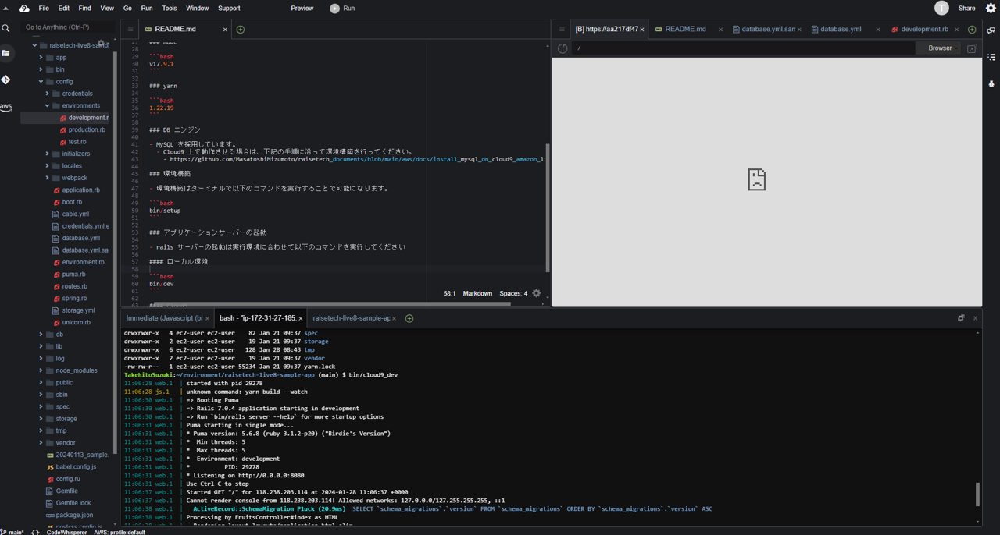
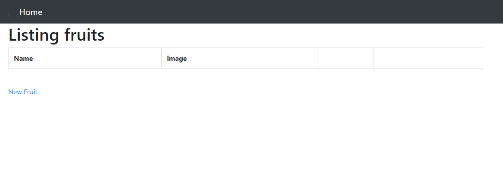
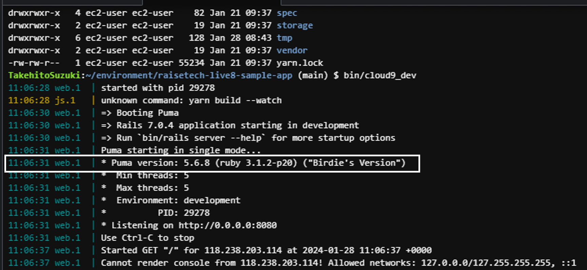
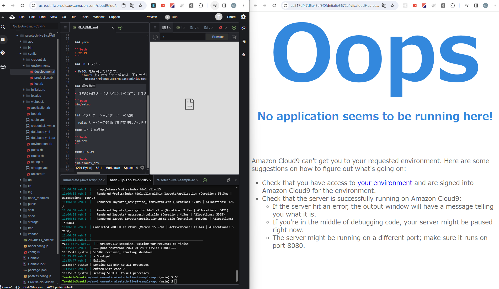
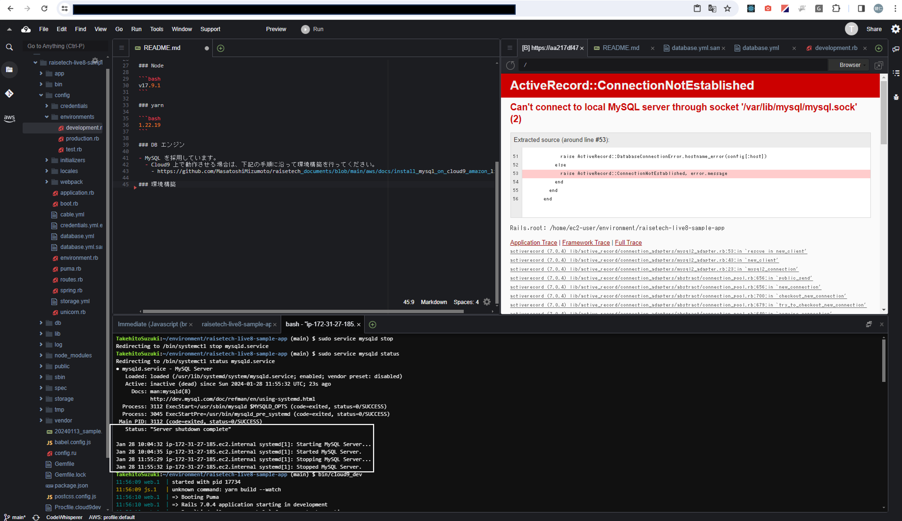
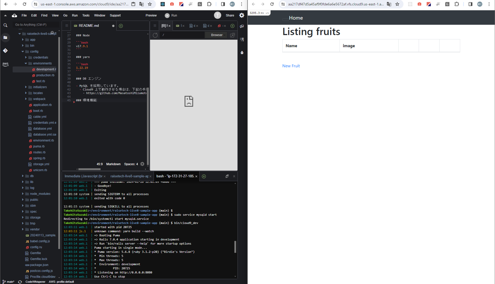

# 第4回講義の感想
* 講義内容
  - Web アプリケーションについて
  - APサーバやDBサーバのデプロイについて

* 講義の感想
  - 今回の講義は難しく、かなり時間が掛かってしまった。
  - 講義では理解できなかった部分が、実際に手を動かしてみることで少しずつ理解できた。

* 講義のエビエビデンス
  - 1.VPCの作成
    
  - 2.ブラウザでアクセス完了
    
  - 3.APサーバ　Puma ver5.6.8
    
  - 4.APサーバ停止後にアクセス
    
  - 5.DBサーバ　MySQL ver8.0.36　
    
  - 6.DBサーバ停止後にアクセス
    
  - 7.DBサーバ起動後にアクセス
    
  - 8.Railsの構成管理ツール
    
