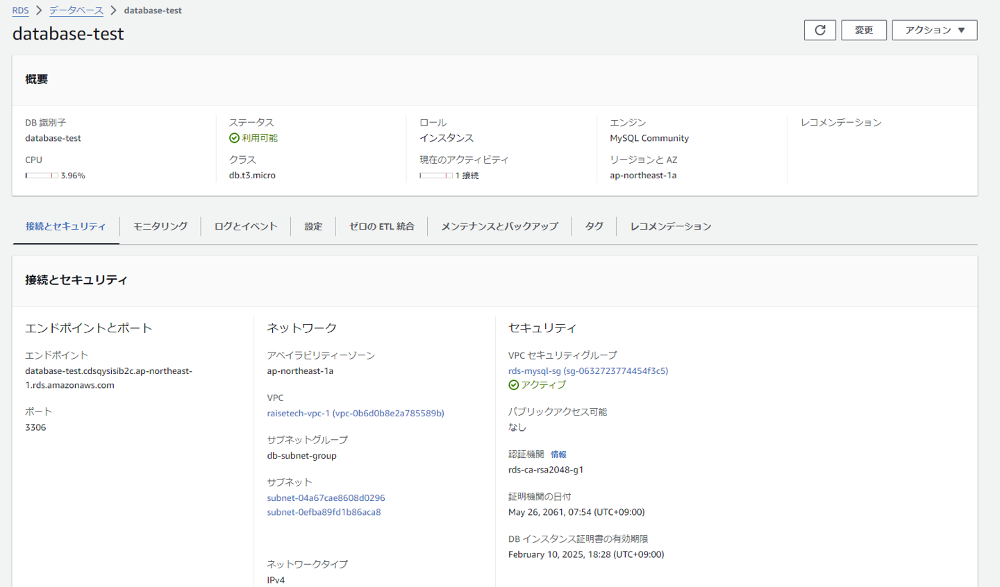
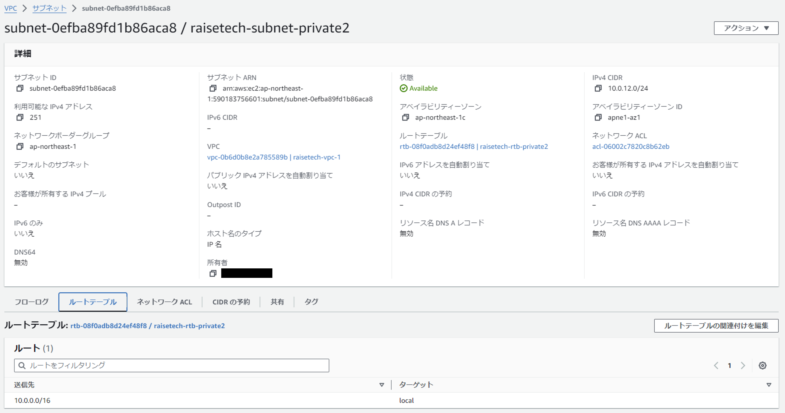

# 第4回講義の感想
* 講義内容
  - AWSでの権限設定について
  - VPC、EC2、RDSについて

* 講義の感想
  - 今回の講義から本格的な構築に入ったため、NW関連の知識もインプットすることができた。
  - AWSの基本的な機能や、構造について理解を深めることができた。

* 講義のエビエビデンス
  - 1.VPCの作成
    
  - 2.EC2の作成
    
  - 3.RDSの作成
    
    
    
    - 3.1 RDSにおけるサブネットの補足
      
      
  - 4.ECSからRDSに接続 
  　
   
